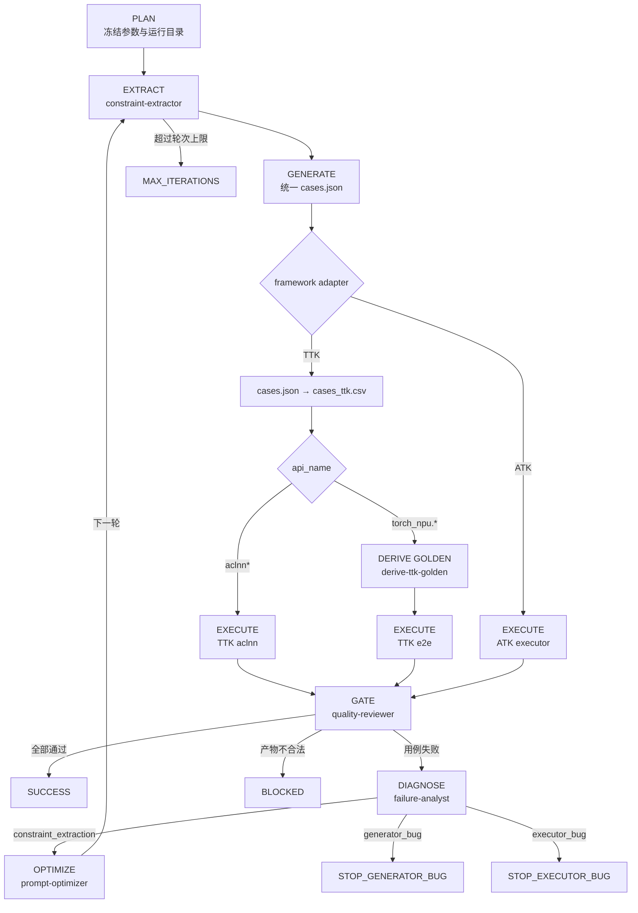

# Claude Code CLI 流程规划与执行设计

## 1. 设计目标

本项目把 Claude Code 作为顶层运行时。规划、专家选择、上下文隔离、阶段调度和循环
判断都在 CLI 中可见；Python 不再创建隐藏 LLM session，只执行可重复的确定性动作。

核心原则：

1. **先规划再执行**：每次 run 先固化参数、阶段、Agent 和终止条件。
2. **角色隔离**：提取、生成、执行、诊断、优化由不同 Agent 独立完成。
3. **文件交接**：Agent 之间只认已校验的落盘产物。
4. **调度可见**：委派文本、CLI Agent 面板、Hooks 和 JSONL 四层观测。
5. **失败可分流**：只有约束提取问题进入提示词迭代，代码或环境问题立即止损。

## 2. 规划阶段

`/iterate-operator` 先解析并冻结：

| 项 | 默认值 | 规划影响 |
|---|---|---|
| operator-doc | 必填；支持项目外路径 | 初始化时只读快照到 run/inputs |
| prompt | 当前 family 数值版本最新的 vN prompt | 确定首轮提取规则；显式 `--prompt` 可固定原样快照 |
| max-iterations | 5 | 防止无界循环 |
| case-count | 10/平台 | 控制生成与执行规模 |
| mode | real | 缺配置则停止提示；仅显式 `--mode mock` 使用 Mock |
| server-config | servers.json | 真实执行机、平台和环境初始化配置 |
| supplement-constraints | 可选；支持项目外路径 | EXTRACT 后据此做关系补充，为空则跳过补充阶段 |
| operator-family | auto | `torch_npu` 文档自动选 hs，否则 aclnn；CLI 接受 `torch_npu` 作为 hs 别名 |
| test-framework | auto | ACLNN→atk（可显式 ttk）；六个已适配 torch_npu→ttk；其余 torch_npu→constraints-only |

`init_run.py` 先校验外部文档和真实执行配置。配置不完整时返回结构化提示且不创建
run；校验通过后将外部文档复制为项目内快照并创建 run_state。主协调器必须展示调度
计划，用户能在真正执行前看见：
哪些 Agent 会参与、每个 Agent 接收什么、产出什么、为何停止或继续。

未显式传入 `--prompt` 时，初始化脚本按 family 扫描：ACLNN 使用
`prompts/operator_constraints_extract_vN.md` 并由 `scripts/select_prompt.py` 装配
`prompts/modules/**`；torch_npu 使用 `prompts/torch_npu_constraints_extract_vN.md`
并由 `scripts/select_torch_npu_prompt.py` 装配 `knowledge/torch_npu/**`。版本按整数 N
（而非文件名字典序）选择。两套装配根互斥。选中的源路径、命中模块和 run 内完整快照
均写入 run_state，因此后续新增版本不会改变已经创建的 run。

## 3. 执行状态机

## 4. 单轮执行协议

### EXTRACT

输入：run/inputs 中的算子文档快照、prompt_vN。  
执行者：constraint-extractor。  
完成条件：constraints.json 通过 Pydantic/结构校验。  
失败策略：同一 Agent 最多自修正三次，之后阻断，不把非法 JSON 传下游。

### EXTRACT fork-join

当 `run_state.operator_src_snapshot` 非空时，EXTRACT 阶段并行委派
`constraint-extractor`（产 `constraints.json`）与 `source-analyst`（产
`source_raw.json` + `supplementary-doc.md`/`uncertain-doc.md`/`conflict-doc.md`/
`conflict_candidates.json`）。两者只读文档快照、互不写对方产物，可并行；barrier
后进 SUPPLEMENT。`operator_src_snapshot` 为空时退回纯文档驱动（只 constraint-extractor）。

### SUPPLEMENT（条件触发，非独立状态）

输入：`inputs/supplementary-doc.md`（source-analyst 产，主源）与/或
`inputs/supplement_constraints.md`（`--supplement-constraints` 手写）+ 已提取
`constraints.json`。两者都空则跳过。  
执行者：constraint-supplementer（产出 `constraints_patch.json`）。  
合并：`scripts/apply_supplement_constraints.py` 确定性合并 patch 进 `constraints.json`
（标 `origin="supplement"`、剥离 patch 层字段），重跑 normalize + validate。  
完成条件：合并后 `constraints.json` 通过 normalize + validate。  
失败策略：合并器或 revalidate 失败则阻断，不进 GENERATE；patch schema/精确匹配
失败由 constraint-supplementer 自修正最多三次。

### conflict 异步裁决（非阻塞）

source-analyst 产 `conflict-doc.md` 后，若非空，主协调器输出 `requires_user_action`
提示（`code=CONFLICT_REQUIRES_REVIEW`），**不阻塞**主流程，继续 GENERATE。用户在
任意时刻回 `inputs/conflict_resolution.json`，下轮 re-supplement 前由
`scripts/apply_conflict_resolution.py` 把 source-wins 转 replace patch 并入
（`origin="conflict_resolution"` + revalidate）。冲突永远走人工通道，不自动消费。

### GENERATE

输入：已校验 constraints.json 和 run_state.test_framework。
执行者：case-generator。  
动作：所有框架先调用原有 Z3 生成器得到统一 `cases.json`；ATK直接消费，TTK通过
adapter 生成 `cases_ttk.csv` 和转换审计。torch_npu/E2E 额外生成 Golden manifest；
ACLNN 使用 constraints 中的 GetWorkspaceSize 或一段式 callable 签名生成原生 ACLNN CSV。
完成条件：`cases.json` 非空；TTK 还要求 CSV 与 audit 结构合法。
失败策略：不让 LLM 手工“补齐”用例，保留 generator_bug 证据。

### EXECUTE

输入：已校验 cases.json。  
执行者：case-executor。  
动作：ATK 默认走 SSH/ATK；TTK 根据 CSV `api_name` 自动执行 `ttk aclnn` 或
`ttk e2e`，远程能力未配置时明确阻断。
完成条件：execution_result.json 统计自洽。  
失败策略：服务器配置缺失时先提示用户且不执行；其他引擎故障单独写 engine_error，
避免污染用例通过率，禁止自动降级 Mock。

### GATE

输入：本轮全部已生成产物。  
执行者：quality-reviewer。  
动作：结构校验 + 跨文件一致性检查。  
输出：quality_gate.json 和唯一 next_state。  
门禁 Agent 不修复其他 Agent 的产物，避免职责串味。

### DIAGNOSE / OPTIMIZE

failure-analyst 使用新上下文，只读取落盘事实。当 `operator_src_snapshot` 非空时，
先委派 source-analyst diagnose 域（error_string 模糊匹配失败日志，命中的 uncertain
追加到 `supplementary-doc.md`，产 `source_evidence.json`），failure-analyst 读它下根因。

constraint_extraction 根因走**两级补救**：
1. 补充优先：`source_evidence.log_match` 非空或 failure-analyst 产了
   `supplement_additions.md` → re-EXTRACT + re-SUPPLEMENT + re-GENERATE + re-EXECUTE，
   **不走 prompt-optimizer**。
2. 补充无可提取 → 才回退 prompt-optimizer 生成 prompt_vN+1。

generator_bug / executor_bug 立即止损。这样避免执行环境故障反复“优化”提示词，
也避免生成器代码 bug 被错误掩盖。TTK 的
UNSUPPORTED/GOLDEN_FAILURE 归入 golden_derivation；CSV映射错误归入 ttk_adapter；
SSH/CANN/TBE/NPU环境归入 execution_environment。

prompt-optimizer 也按 `run_state.operator_family` 隔离：ACLNN 的修复只能定位到 ACLNN
基线/模块；torch_npu 的修复只能定位到 torch_npu 基线/知识模块。run 内下一轮仍使用
完整 `prompt_vN+1.md` 覆盖快照，不在优化阶段交叉装配另一 family。

### constraints-only

对尚无 TTK adapter 的 torch_npu API，auto 选择 `test_framework=constraints`、
`run_scope=constraints_only`。EXTRACT 和可选 SUPPLEMENT 通过 normalize/validate 后即以
`CONSTRAINTS_ONLY_SUCCESS` 事件结束；不进入 GENERATE/EXECUTE，也不要求服务器配置。
该 SUCCESS 只表示约束文件有效，不能报告为用例或精度闭环成功。用户显式选择 `ttk`
仍可用于开发新 adapter，但未注册算子会在生成阶段明确拒绝。

## 5. 串并行设计

主链路有严格数据依赖，EXTRACT、GENERATE、EXECUTE、GATE 必须串行。质量门禁内部的
只读结构检查可以并行，但只能由主协调器发起，且不得让多个 Agent 写同一文件。

在 Claude Code 中可通过 `/agents` 查看正在运行和最近完成的 Agent。若未来把同一算子
的多个平台拆成并行执行，应为每个平台分配独立目录，汇总前执行一次统一门禁。

## 6. 循环与终止

每次状态迁移都更新 `run_state.json`。循环只在以下条件同时成立时发生：

- 根因严格等于 constraint_extraction；
- 新提示词已生成并通过基本检查；
- 当前轮次小于 max_iterations；
- quality_gate 没有阻断问题。

其他根因立即停止并给出下一步建议，不自动改代码或重试远端。

## 7. 恢复执行

会话中断后，使用 `claude --continue` 或重新启动 Claude，读取 run_state.json，从最后一个
完成状态继续。任何 Agent 都不得依赖聊天历史恢复事实；产物目录是唯一真相源。

## 8. 目录批次

`/iterate-directory` 在单算子状态机外增加一层确定性的串行队列。初始化时一次性冻结
目录、glob、文件顺序、单算子参数和失败策略；随后每次只认领一个文档，并为它创建或
恢复一个独立的 `/iterate-operator` run。

默认批次允许目录混合 ACLNN 与 torch_npu 文档：claim 只透传 `operator-family=auto`，
每个 `init_run` 独立选择对应 baseline 和知识模块。只有用户显式给出 `--prompt` 时才把
同一个原样 prompt 透传整批；这属于用户主动固定版本，不经过 family 模块装配。
扫描 torch_npu 文档目录时，已知导航页 `torch_npu.md`、`torch_npu_list.md` 会被排除，
不会为没有 callable 的索引创建 run。

默认 `continue-on-error`：`SUCCESS` 计为成功，`BLOCKED`、`MAX_ITERATIONS`、
`STOP_GENERATOR_BUG` 和 `STOP_EXECUTOR_BUG` 计为失败，但不会阻止后续文档执行。
`--fail-fast` 会在首个非 SUCCESS 终态后把批次置为 STOPPED。这里的“全部执行完毕”
表示所有队列项都进入终态，不等价于全部成功。

批次状态保存在 `runs/batches/<batch-id>/batch_state.json`。当前算子 run 创建后立即
关联 `run_dir`；会话中断时先恢复该 run，完成后再认领下一项。批次脚本不调用 LLM，
只承担扫描、状态迁移和汇总。
