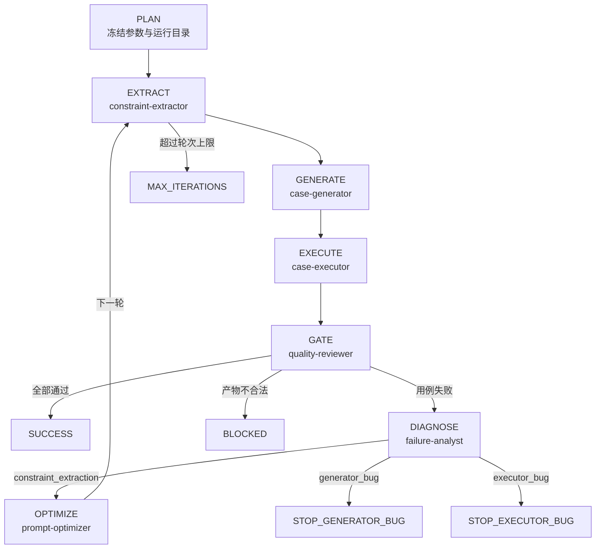

# Claude Code CLI 流程规划与执行设计

## 1. 设计目标

本项目把 Claude Code 作为顶层运行时。规划、专家选择、上下文隔离、阶段调度和循环
判断都在 CLI 中可见；Python 不再创建隐藏 LLM session，只执行可重复的确定性动作。

核心原则：

1. **先规划再执行**：每次 run 先固化参数、阶段、Agent 和终止条件。
2. **角色隔离**：提取、生成、执行、诊断、优化由不同 Agent 独立完成。
3. **文件交接**：Agent 之间只认已校验的落盘产物。
4. **调度可见**：委派文本、CLI Agent 面板、Hooks 和 JSONL 四层观测。
5. **失败可分流**：只有约束提取问题进入提示词迭代，代码或环境问题立即止损。

## 2. 规划阶段

`/iterate-operator` 先解析并冻结：

| 项 | 默认值 | 规划影响 |
|---|---|---|
| operator-doc | 必填；支持项目外路径 | 初始化时只读快照到 run/inputs |
| prompt | 数值版本最新的 vN prompt | 确定首轮提取规则；显式 `--prompt` 可固定版本 |
| max-iterations | 5 | 防止无界循环 |
| case-count | 10/平台 | 控制生成与执行规模 |
| mode | real | 缺配置则停止提示；仅显式 `--mode mock` 使用 Mock |
| server-config | servers.json | 真实执行机、平台和环境初始化配置 |
| source-root | 空（可选） | 提供时启用源码校验：定位+只读复制源码到 src_snapshot，EXTRACT 后校验约束；为空则纯文档驱动 |

`init_run.py` 先校验外部文档和真实执行配置。配置不完整时返回结构化提示且不创建
run；校验通过后将外部文档复制为项目内快照并创建 run_state。主协调器必须展示调度
计划，用户能在真正执行前看见：
哪些 Agent 会参与、每个 Agent 接收什么、产出什么、为何停止或继续。

未显式传入 `--prompt` 时，初始化脚本扫描
`prompts/operator_constraints_extract_vN.md`，按整数 N（而非文件名字典序）选择最新
版本。选中的源路径和项目内快照均写入 run_state，因此后续新增提示词版本不会改变
已经创建的 run。

## 3. 执行状态机

## 4. 单轮执行协议

### EXTRACT

输入：run/inputs 中的算子文档快照、prompt_vN。  
执行者：constraint-extractor。  
完成条件：constraints.json 通过 Pydantic/结构校验。  
失败策略：同一 Agent 最多自修正三次，之后阻断，不把非法 JSON 传下游。

**源码校验（可选子步骤，每轮一次）**：仅当 `run_state.operator_src_snapshot` 非空时，
在 EXTRACT 完成、GENERATE 之前委派 `source-analyst`：调
`scripts/extract_source_constraints.py` 抽 `source_raw.json`，再判读产
`source_evidence.json`（cross_check + hard_constraints + doc_error）与
`constraints_patch.json`；主协调器调 `scripts/apply_constraints_patch.py` 单次应用并
重校验，失败回滚不重试，残留 `cross_check.overbroad` 交 GATE 阻断。首轮与 re-EXTRACT
后都跑；`operator_src_snapshot` 为空时跳过，状态机主线不变。

### GENERATE

输入：已校验 constraints.json。  
执行者：case-generator。  
动作：调用原有确定性 Z3/参数组合生成器。  
完成条件：cases.json 非空且结构合法。  
失败策略：不让 LLM 手工“补齐”用例，保留 generator_bug 证据。

### EXECUTE

输入：已校验 cases.json。  
执行者：case-executor。  
动作：默认 real，走 operator-agent 执行子图与 SSH/ATK；只有用户显式选择才使用 Mock。  
完成条件：execution_result.json 统计自洽。  
失败策略：服务器配置缺失时先提示用户且不执行；其他引擎故障单独写 engine_error，
避免污染用例通过率，禁止自动降级 Mock。

### GATE

输入：本轮全部已生成产物。  
执行者：quality-reviewer。  
动作：结构校验 + 跨文件一致性检查。  
输出：quality_gate.json 和唯一 next_state。  
门禁 Agent 不修复其他 Agent 的产物，避免职责串味。

### DIAGNOSE / OPTIMIZE

failure-analyst 使用新上下文，只读取落盘事实。三类根因中只有
constraint_extraction 允许 prompt-optimizer 生成 prompt_vN+1。这样避免执行环境故障
反复“优化”提示词，也避免生成器代码 bug 被错误掩盖。

## 5. 串并行设计

主链路有严格数据依赖，EXTRACT、GENERATE、EXECUTE、GATE 必须串行。质量门禁内部的
只读结构检查可以并行，但只能由主协调器发起，且不得让多个 Agent 写同一文件。

在 Claude Code 中可通过 `/agents` 查看正在运行和最近完成的 Agent。若未来把同一算子
的多个平台拆成并行执行，应为每个平台分配独立目录，汇总前执行一次统一门禁。

## 6. 循环与终止

每次状态迁移都更新 `run_state.json`。循环只在以下条件同时成立时发生：

- 根因严格等于 constraint_extraction；
- 新提示词已生成并通过基本检查；
- 当前轮次小于 max_iterations；
- quality_gate 没有阻断问题。

其他根因立即停止并给出下一步建议，不自动改代码或重试远端。

## 7. 恢复执行

会话中断后，使用 `claude --continue` 或重新启动 Claude，读取 run_state.json，从最后一个
完成状态继续。任何 Agent 都不得依赖聊天历史恢复事实；产物目录是唯一真相源。

## 8. 目录批次

`/iterate-directory` 在单算子状态机外增加一层确定性的串行队列。初始化时一次性冻结
目录、glob、文件顺序、单算子参数和失败策略；随后每次只认领一个文档，并为它创建或
恢复一个独立的 `/iterate-operator` run。

默认 `continue-on-error`：`SUCCESS` 计为成功，`BLOCKED`、`MAX_ITERATIONS`、
`STOP_GENERATOR_BUG` 和 `STOP_EXECUTOR_BUG` 计为失败，但不会阻止后续文档执行。
`--fail-fast` 会在首个非 SUCCESS 终态后把批次置为 STOPPED。这里的“全部执行完毕”
表示所有队列项都进入终态，不等价于全部成功。

批次状态保存在 `runs/batches/<batch-id>/batch_state.json`。当前算子 run 创建后立即
关联 `run_dir`；会话中断时先恢复该 run，完成后再认领下一项。批次脚本不调用 LLM，
只承担扫描、状态迁移和汇总。
