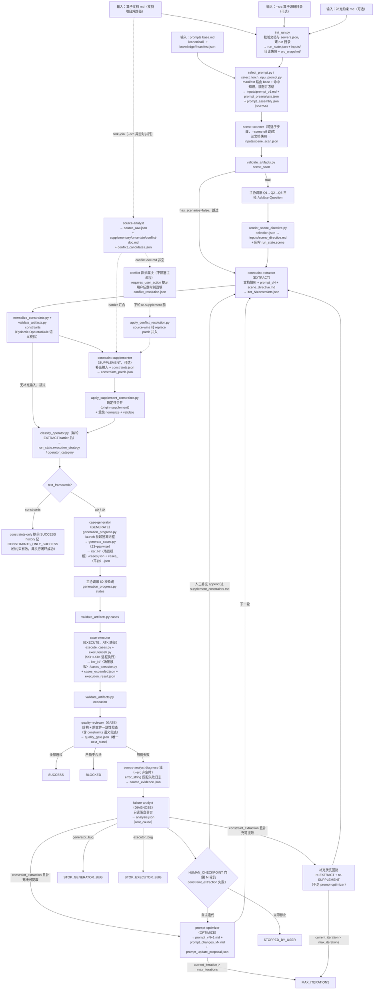

# 项目整体分析报告（"Agent 应用"视角）

> 分析对象：`operator-common-iterator-claude`（CANN 算子迭代测试的 Claude Code CLI 原生编排器）
> 分析时间：2026-09-01
> 分析视角：作为一个"Agent 应用"，它的架构设计、工程化程度、创新点与风险缺口

---

## 一、项目定位一句话

把 Claude Code CLI 当作顶层运行时和编排器，用 **9 个专职 Subagent + 16 个 Skill + 状态机 + 文件产物契约** 驱动"算子文档 → 约束提取 → 用例生成 → 真实执行 → 诊断 → 提示词优化"的闭环迭代；Python 只承担确定性业务（Z3 求解、校验、执行适配、调度留痕），**不再嵌套调用 LLM**。

## 二、规模画像（实测数据）

| 模块 | 规模 | 角色 |
|---|---|---|
| `agent/generators/` | 145 个 py，24,277 LOC（只读保护） | Z3 约束求解 + pairwise 用例生成器 |
| `agent/hs/` | 16 个 py，4,812 LOC | 海思 TTK 场景规划、Golden、约束评估 |
| `scripts/` | 37 个 py CLI，12,577 LOC | 确定性工具，不调 LLM |
| `executer/` | 7 个 py，4,155 LOC（只读保护） | SSH + ATK/TTK 远程执行适配 |
| `.claude/agents/` | 9 个 Agent 定义，共 443 行 | Subagent 角色契约 |
| `.claude/skills/` | 16 个 Skill（最长 1,455 行） | 阶段流程与领域方法 |
| `.claude/hooks/` | 2 个 Python Hook | 调度观测 + 写入守卫 |
| `knowledge/` | aclnn 27 个模块 + torch_npu 16 个模块 | manifest 驱动的可路由知识库 |
| `docs/` | 12 份契约文档 | WORKFLOW / ARTIFACT_CONTRACTS / PERMISSIONS 等 |
| Python 总计 | ≈47,182 LOC | — |

这是"Agent 应用"里罕见的重工程：**编排层薄（协议文本）、确定性层厚（4.7 万行）**，与常见的"薄壳调 API"型 Agent 项目完全相反。

## 三、架构分层（见上方架构图）

1. **主协调器（Claude Code 主会话）**：状态机推进者。`PLAN → EXTRACT → GENERATE → EXECUTE → GATE`，失败走 `DIAGNOSE`，仅 `constraint_extraction` 根因才进入 `OPTIMIZE → EXTRACT` 循环；`generator_bug / executor_bug` 立即止损。
2. **9 个专职 Subagent**：scene-scanner、constraint-extractor、source-analyst、constraint-supplementer、case-generator、case-executor、failure-analyst、prompt-optimizer、quality-reviewer。每个 Agent 独立上下文，通过 Skill 预加载领域方法。
3. **确定性 Python 层**：`scripts/` 全部不调 LLM；`init_run.py` 建目录与状态、`validate_artifacts.py` 全阶段结构+语义校验、`generate_cases.py`（Z3+pairwise）、`normalize_constraints.py`、知识路由与装配校验等。
4. **提示词与知识层**：`base.md` 为 canonical 直接编辑，`knowledge/<family>/manifest.json` 驱动路由（正向 trigger + `reject_on` 负向否决 + `depends_on` 依赖闭包），run 初始化时装配并**冻结** `prompt_v1.md` + sha256 组装记录。
5. **文件交接层**：Agent 之间只认 `runs/<run-id>/` 下已校验的落盘产物，`run_state.json` 是唯一真相源；Hook 强制活动任务只能写当前 run 目录。

## 四、作为 Agent 应用的九个设计亮点

1. **职责分层干净**：LLM 判断（提取/诊断/优化）与确定性计算（求解/校验/执行）严格分离——LLM 不写用例、Python 不调模型。这是整个项目最重要的架构决策。
2. **文件契约即接口**：阶段间不用内存对象、不用聊天历史，只交接 JSON/Markdown 产物，且每个产物有结构校验（`validate_artifacts.py`）+ 语义校验（Pydantic `OperatorRule`）。可恢复、可审计、可复现。
3. **根因分流止损**：`analysis.json.root_cause` 三值枚举（constraint_extraction / generator_bug / executor_bug），只有第一类才允许提示词迭代，避免用"优化提示词"掩盖代码 bug 或环境故障。这是很多 Agent 闭环系统缺失的纪律。
4. **知识路由与冻结**：manifest 驱动的知识模块（触发器/否决/依赖闭包），run 内冻结 sha256——单 run 可复现，知识演进只发生在 run 之间且需用户逐条批准。**prompt 演进被当作带审批流的变更管理**，不是自由生长。
5. **人工介入有三个结构化通道**：SCENE_SCAN 三轮顺序征询（Q1 设备→Q2 模板→Q3 特性参数，依赖前轮答案所以必须分轮）、冲突异步裁决（不阻塞主流程，人工回填 `conflict_resolution.json`）、HUMAN_CHECKPOINT 门（第 N 轮仍失败时三选一：人工补充/自主迭代/停止）。
6. **写入守卫与权限模型**：`guard_project_writes.py` Hook + sandbox denyWrite 双层强制——生成器与执行器目录只读、`servers.json` 禁改、`.env` 禁读、活动 run 之外禁写。"Agent 最小权限"落到了可执行层面。
7. **长任务的进程脱离方案**：`generation_progress.py launch` 用 `CREATE_BREAKAWAY_FROM_JOB`（Windows）/ `setsid`（POSIX）把数小时的 Z3 生成拉成脱离会话的子进程，子 Agent 只"启动+报告"即结束，主协调器以 60 秒节奏轮询 status。这是针对"会话生命周期杀死后台任务"这一真实故障模式的工程化修复（文档里连故障签名都写清了）。
8. **可观测性四层**：委派前后文本 → CLI Agent 面板 → trace_hook 调度事件 JSONL → run_state.history。批次目录（`/iterate-directory`）支持中断恢复、fail-fast、continue-on-error。
9. **双 family 同构隔离**：ACLNN 与 torch_npu 各自独立的 base prompt + 知识根 + 路由器 + 校验器，跨 family 引用被 validator 拒绝；约束提取与测试框架解耦（atk / ttk / constraints-only 三档，无 TTK adapter 的 API 自动降级为 constraints-only 且诚实标注"仅约束有效，不代表执行闭环成功"）。

## 五、与"约束提取瓶颈"的关联（当前主要矛盾）

项目所有机制最终服务于一个量化目标：提高 `constraints_in_parameters` 的提取准确率。现有 Agent 设计中直接服务于此的机制：

- **源码 fork-join**：`--src` 提供源码快照时，extractor 与 source-analyst 并行，产 `source_raw.json` + 补充/不确定/冲突三份文档，经 SUPPLEMENT 确定性合并回 constraints——文档与源码双证据源。
- **两级补救**：constraint_extraction 失败先走"补充优先"（source_evidence 命中或人工补充 → 直接 re-EXTRACT，不走 prompt-optimizer），补充无可提取才回退提示词优化。避免不必要的 prompt 抖动。
- **缺口**：整个系统仍缺少 `constraints_in_parameters` 的**准确率量化指标**（对标注集的 precision/recall），闭环目前以"用例执行通过率"为间接信号。这与您记忆中的瓶颈判断一致：验证迭代机制有骨架（轮次/门禁/止损），但缺"提取质量本身的量化标尺"。

## 六、数据流转全景

本节把第五节的状态机展开为"数据视角"的全链路视图：数据从哪里进来、每一步由谁经哪个脚本加工成什么产物、产物经什么校验关卡流向下游。所有 Agent 之间不传内存对象，全部通过 `runs/<run-id>/` 下已校验的落盘产物交接，`run_state.json` 是唯一真相源。

### 6.1 全链路数据流图

### 6.2 数据流明细表

> **状态粒度注记（据真实 run 核对）**：`run_state.state` 字段实际只在 `PLAN → EXTRACT → ITER_N → 终态` 之间粗粒度推进（实测 `aclnnGroupedMatmulV5` run 的 history 为 `PLAN → EXTRACT → ITER_2 → EXTRACT → MAX_ITERATIONS`）。GENERATE / EXECUTE / GATE / DIAGNOSE / SCENE_SCAN / SUPPLEMENT / CLASSIFY 均为子步骤，靠已校验产物文件交接推进；GATE 产出的 `quality_gate.next_state`（如 `DIAGNOSE`）是建议值，不写入 `state` 字段。上图的节点是「阶段 / 执行者」，非 `state` 字段枚举。

| 阶段 | 执行者（模块/Agent） | 调用脚本 | 输入数据 | 输出产物 | 校验关卡 |
|---|---|---|---|---|---|
| PLAN 初始化 | 主协调器 | `init_run.py` | 算子文档 md（可项目外）、`--src`、`--supplement-constraints`、`servers.json` | run 目录、`run_state.json`、`inputs/` 文档快照、`inputs/src_snapshot/` | 文档与真实执行配置校验，缺配置停止且不建 run |
| 提示词装配冻结 | 主协调器（init_run 内触发） | `select_prompt.py` / `select_torch_npu_prompt.py` | prompts `base.md`（canonical）+ `knowledge/<family>/manifest.json` | `inputs/prompt_v1.md` + `prompt_preanalysis.json` + `prompt_assembly.json`（sha256） | `validate_prompt_assembly.py` 校验装配记录与模块顺序 |
| SCENE_SCAN（可选） | scene-scanner + 主协调器 | `validate_artifacts.py scene_scan`；`check_scene_conflicts.py`；`render_scene_directive.py` | `inputs/<doc>.md`（只读）；用户 Q1/Q2/Q3 选择 → `selection.json` | `inputs/scene_scan.json`、`inputs/selection.json`、`inputs/scene_conflicts.json`、`inputs/scene_directive.md`、`run_state.scene` | scene_scan 结构校验；render 对非法选择 exit 2 阻断，不静默回退 |
| EXTRACT | constraint-extractor | —（Agent 产物落盘） | 文档快照、`prompt_vN`、`scene_directive.md`（若存在） | `iter_00N/constraints.json` | 写 `constraints.json` 前校验 state 已是 EXTRACT；Pydantic `OperatorRule` |
| EXTRACT fork-join（可选） | source-analyst | —（Agent 产物落盘） | 文档快照、`inputs/src_snapshot/` | `source_raw.json` + `supplementary-doc.md` / `uncertain-doc.md` / `conflict-doc.md` + `conflict_candidates.json` | 两者只读文档、互不写对方产物，barrier 汇合后进 SUPPLEMENT |
| normalize + validate | 主协调器 | `normalize_constraints.py`、`validate_artifacts.py constraints` | `constraints.json` | 规范化后的 `constraints.json`（Tensor format、dtype 等） | `OperatorRule` 结构 + 语义校验；失败阻断、不进 GENERATE（EXTRACT 自修正 ≤3 次） |
| SUPPLEMENT（可选） | constraint-supplementer | `apply_supplement_constraints.py` | `supplementary-doc.md` 与/或 `supplement_constraints.md` + 已提取 `constraints.json` | `constraints_patch.json` → 合并后 `constraints.json`（新增条目标 `origin="supplement"`）；合并前备份 `constraints.json.pre_supplement` | 合并后重跑 normalize + validate，失败阻断、不进 GENERATE |
| conflict 异步裁决 | 用户 + 主协调器 | `apply_conflict_resolution.py` | `conflict_candidates.json` + 用户回填 `conflict_resolution.json` | source-wins 转 replace patch 并入 `constraints.json`（`origin="conflict_resolution"`） | `doc_expr` 精确匹配，失败阻断；提示不阻塞主流程 |
| CLASSIFY | 主协调器 | `classify_operator.py` | `inputs/<doc>.md` | 回写 `run_state.json` 的 `execution_strategy` / `operator_category` | 读 stdout JSON；不进 constraints.json |
| constraints-only 终止 | 主协调器 | `validate_artifacts.py constraints` | `constraints.json` | `run_state.state=SUCCESS`，history 记 `CONSTRAINTS_ONLY_SUCCESS` | normalize + validate 通过；跳过 GENERATE/EXECUTE，不要求服务器配置 |
| GENERATE | case-generator（启动）+ 主协调器（等待） | `generation_progress.py launch` → 脱离进程跑 `generate_cases.py`（Z3+pairwise）；主协调器 `generation_progress.py status` 轮询 | `constraints.json`（含 `product_support`）、`run_state.test_framework`、`hs_scenario_mode` | 落 `iter_N/<场景模板>/` 子目录：`cases.json`、逐平台 `cases_<平台名>.json`（斜杠转下划线）、`generation_summary.json`、`generation_progress.json`、`generate_result.json`、`generation_console.log`（TTK 另有 `cases_ttk.csv`、`ttk_conversion_audit.json`，E2E 另有 `golden_manifest.json`） | `validate_artifacts.py cases`；禁止 LLM 手工补齐用例 |
| EXECUTE | case-executor | `execute_cases.py` + `executer/ssh.py`（SSH+ATK）；`executer/resources/generator.py` 生成执行脚本 | `iter_N/<场景模板>/cases.json`（执行期展开为 `cases_expanded.json`）、`servers.json` | 落 `iter_N/<场景模板>/` 子目录：`cases_executor.py`、`cases_expanded.json`、`execution_result.json`、`execution.log` | `validate_artifacts.py execution`（passed+failed=total）；engine_error 单独落盘，禁止自动降级 Mock |
| GATE | quality-reviewer | —（Agent 产物落盘） | 本轮全部已生成产物 | `quality_gate.json`（status / checks / blocking_issues / next_state） | blocking_issues 非空时 status 必须为 blocked；跨文件校验含 constraints 语义兜底，可拦回 re-EXTRACT |
| DIAGNOSE | failure-analyst（--src 非空时前置 source-analyst diagnose 域） | —（Agent 产物落盘） | `execution_result.json`、`cases.json`/`cases_expanded.json`、`source_evidence.json` | `analysis.json`（root_cause + specific_issues）；补充可提取时另产 `supplement_additions.md` | `validate_artifacts.py analysis`；root_cause 枚举约束 |
| OPTIMIZE（条件） | prompt-optimizer | —（Agent 产物落盘） | `analysis.json` + 文档证据 + 当前 `prompt_vN` | `prompt_vN+1.md`、`prompt_changes_vN.md`、`prompt_update_proposal.json` | 仅 constraint_extraction 根因进入；canonical 修改须用户逐条批准 |
| HUMAN_CHECKPOINT | 主协调器（AskUserQuestion 三选一） | — | 当前轮 `analysis.json` + `constraints.json` 摘要 + 已尝试轮次 | 人工补充 append 进 `inputs/supplement_constraints.md`，或置 `STOPPED_BY_USER` | 四项触发条件须同时满足；`human_checkpoint_resolved_iteration` 防重复询问 |
| 终态推进 | 主协调器 | —（读写 `run_state.json`） | quality_gate 的 `next_state`、轮次簿记 | `run_state.state` 终态（SUCCESS / BLOCKED / MAX_ITERATIONS / STOP_* / STOPPED_BY_USER）+ history | 每次迁移 append history；可从落盘状态恢复 |
| 目录批次层 | 主协调器 | `init_batch.py`、`batch_state.py`（attach-run / complete） | 目录、glob、单算子参数、失败策略 | `runs/batches/<batch-id>/batch_state.json`、`batch_summary.json` | 任意时刻最多一个 RUNNING 项；fail-fast / continue-on-error 策略 |

### 6.3 关键数据契约简注

- **constraints.json**：必须满足 `agent/generators/common_model_definition.py` 的 Pydantic `OperatorRule`；`allowed_range_value.type=range` 不允许 null 端点（开区间写不等式），`type=enum` 允许 null 作离散候选；由 `validate_artifacts.py constraints` 兜底报错。
- **cases.json**：是执行前的紧凑表示（生成器 CaseConfig 的 model_dump），带 `length` 的列表类输入在执行阶段才展开为 `cases_expanded.json`；诊断用例格式问题必须同时检查两个文件。SCENE 启用时逐平台产物落 `iter_N/<场景模板>/` 子目录（如 `cases_Atlas A2 训练系列产品_Atlas A2 推理系列产品.json`，平台名斜杠转下划线）。
- **run_state.json**：唯一真相源——状态、轮次、参数、scene、prompt 快照全在里面，每次状态迁移 append history；任何 Agent 不得依赖聊天历史恢复事实。
- **execution_result.json**：必须满足 `passed + failed = total`；`engine_error` 非空时不得宣称业务成功——引擎故障与用例失败分流，避免污染通过率。
- **analysis.json**：`root_cause` 为受约束枚举——ARTIFACT_CONTRACTS 列出 constraint_extraction / generator_bug / executor_bug 及 TTK 场景的 ttk_adapter / golden_derivation / execution_environment；状态机只对 `constraint_extraction` 进 OPTIMIZE 回 EXTRACT 的迭代，其余立即止损。
- **prompt 装配冻结**：run 初始化时由 manifest 路由装配 `base + 命中知识` 并冻结为 `prompt_v1.md`，`prompt_assembly.json` 记录 sha256 与模块顺序；extractor 只读冻结快照，知识演进只发生在 run 之间且需用户逐条批准。

### 6.4 数据流设计要点

1. **文件交接即接口**：Agent 间零内存对象、零隐式上下文，全部经 `runs/<run-id>/` 落盘产物交接，每步产物先过 `validate_artifacts.py` 才准进下游——可恢复、可审计、可复现。
2. **每步有校验关卡**：从 scene_scan 到 execution 每个产物都有对应校验子命令，非法 JSON 不传下游；补充/冲突合并自带"合并即重跑 normalize+validate"。
3. **失败产物与成功产物同构落盘**：`engine_error`、`blocking_issues`、`root_cause` 都写进与成功路径相同结构的 JSON，分流靠读字段而非另建通道。
4. **可选分支"空即跳过"**：scene、src fork-join、supplement、conflict 均为条件子步骤，缺输入自动退回纯文档驱动，零回归。
5. **长任务以状态文件交接**：数小时的 Z3 生成跑在脱离会话的进程里，主协调器经 `generation_progress.py status` 读进度 JSON 轮询，等待责任从短寿命子 Agent 上移到主协调器。
6. **场景模板分子目录**：SCENE_SCAN 启用并选定场景后，GENERATE/EXECUTE 产物按 `<场景模板名>/` 分子目录（实测 `iter_003/全量化-A8W8/`），内含逐平台 `cases_<平台名转下划线>.json` 等；未启用 scene 时为扁平 `iter_N/`。`quality_gate.json` 的 `scene_platform_consistency` 检查会核对子目录名与场景模板一致。
7. **state 字段粗粒度推进**：`run_state.state` 只在 `PLAN → EXTRACT → ITER_N → 终态` 推进；GENERATE/EXECUTE/GATE/DIAGNOSE 是子步骤，由 `quality_gate.next_state` 建议 + 产物文件交接推进，不写 `state` 字段。因此看执行轨迹应以「产物目录 + `history`」为准，而非仅 `state` 当前值。

## 七、风险与改进建议

| # | 风险/缺口 | 证据 | 建议 |
|---|---|---|---|
| 1 | **协议文本承担了过多编排逻辑**：`iterate-operator/SKILL.md` 280 行，其中脱离进程等待、轮询纪律、轮询回合排他等纯操作规程占了近 1/4，靠模型自觉遵守 | SKILL.md 第 151-192 行 | 把"等待生成完成"下沉为一个确定性 CLI（如 `wait_generation.py --output-dir`，内部轮询、阻塞返回），主协调器一次调用即得终态，消除整段轮询纪律 |
| 2 | **提取质量缺量化标尺**：无标注集、无 precision/recall 报告，闭环信号是间接的（执行通过率） | docs/ 与 scripts/ 均无指标工具 | 新增 `scripts/score_constraints.py`：对人工标注的 golden constraints 计算字段级/参数级准确率，写入 run_state 作为 OPTIMIZE 决策依据 |
| 3 | **状态机由模型手写 run_state**：state 推进、history append、轮次簿记靠主协调器自觉，写错无强制校验（extract 前置校验 state 只是点状防线） | SKILL.md 第 45-48、242-244 行 | 提供 `scripts/advance_state.py --run-dir --to EXTRACT`（内含 history append 与轮次合法性检查），模型只调不写 |
| 4 | **Hook 写入守卫是正则级防线**：`WRITE_OR_DELETE` 正则匹配 shell 命令，对编码变形、别名、Python 内联仍可能漏（Windows 无 sandbox 兜底场景） | guard_project_writes.py | 可接受为已知边界；关键是文档已声明"Agent 禁止 python -c"，保持该纪律 |
| 5 | **单 Agent 上下文压测**：extractor 面对大文档+装配知识+场景 directive，上下文余量未测；自修正最多三次的失败画像未沉淀数据 | 无运行数据佐证（runs/ 为空） | 待真实批量运行后统计"三次自修正成功率分布"，作为是否引入 extractor 拆分（骨架/参数两段提取）的依据 |
| 6 | **runs/ 当前为空**：所有协议未经本机近期运行验证（或产物已清理），本报告的机制描述基于文档与代码静态分析 | 目录清单 | 用 1-2 个简单算子跑通 `--mode mock` 全链路作为冒烟，验证协议文本与脚本的一致性 |

## 八、结论

从"Agent 应用"的标准看，这是一个**罕见的把 Agent 编排当严肃软件工程来做**的项目：状态机、产物契约、权限边界、变更审批、故障模式修复（进程脱离）、双 family 隔离、批次恢复，全部有对应机制和文档。它的成熟度高于典型 Agent 演示项目一个量级。

下一步最有价值的两件事（与本报告第七节对应）：
1. **把编排协议中的机械环节继续下沉为确定性 CLI**（等待器、状态推进器），让 SKILL.md 从"操作规程"退回"职责说明"；
2. **补上 `constraints_in_parameters` 的量化评分闭环**——这是把"迭代机制"升级为"可验证的改进方法论"的关键一步，也直接呼应《算子知识统一建模与抽取方案》的方法论目标。
